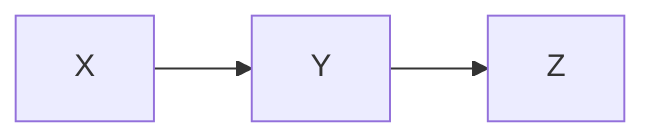

# Model Card

This project implements a small causal model with the DAG $X \to Y \to Z$.
The network enforces three conditional distributions so that the joint is
consistent with this causal ordering.

## Causal DAG

## Assumptions

The model is valid under standard causal inference assumptions:

- **No unmeasured confounders** – all common causes of the treatment and
  outcome are captured in the observed covariates.
- **Consistency** – the observed outcome for a unit receiving a treatment
  equals its potential outcome under that treatment.
- **Positivity** – every treatment has a non-zero probability for each
  covariate pattern.

## Fairness considerations

When sensitive attributes are present in `X`, the learned distributions may
reflect historical bias. Downstream use should assess disparate impact and may
need to apply mitigation strategies such as reweighting or counterfactual
fairness adjustments.

## Robustness checks

The unit tests and examples cover synthetic data generated from the assumed DAG.
We recommend evaluating log likelihood and treatment effect estimates under
perturbations of the data generating process to ensure the model behaves
reasonably when the assumptions are slightly violated.
